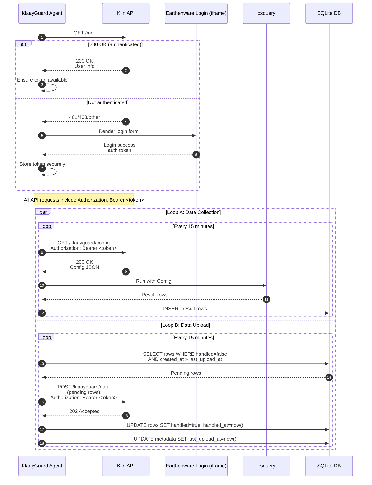

# KlaayGuard

[](https://tauri.app)

**KlaayGuard** is a cross-platform desktop security monitoring application that collects system information using osquery and reports it to a centralized API for security analysis.

## 🎯 Purpose

KlaayGuard automatically:

- Installs and manages osquery on Windows, macOS, and Linux
- Collects system security data (processes, network connections, installed software, etc.)
- Reports data to your configured API every 15 minutes (defaults to `http://localhost:3000`)
- Runs as a system tray application for background monitoring
- Provides authentication and secure data transmission

## KlaayGuard authentication, data collection, and upload sequence



## 🚀 Quick Start

## Downloading a precompiled dev build (Mac)

1. navigate to https://github.com/klaayinc/klaayguard/releases

2. look for the most recent "dev" release

3. download the appropriate package, this will probably be klaay_XXX_aarch64.dmg for apple silicon macs

4. install the package

## Compile dev build (Linux)

1. clone the repo:
   ```bash
   git clone https://github.com/klaayinc/klaayguard.git
   cd klaayguard
   ```

### Prerequisites

KlaayGuard is a tray-only Rust/Tauri agent — no Node.js or frontend toolchain.

```bash
# Install Rust
curl --proto '=https' --tlsv1.2 -sSf https://sh.rustup.rs | sh
source ~/.cargo/env

# Install the Tauri CLI (Rust, not npm)
cargo install tauri-cli --version "^2"

# Ruby/rake (for vendoring the osquery sidecars) — preinstalled on macOS
```

### Setup & Development

```bash
git clone https://github.com/klaayinc/klaayguard.git
cd klaayguard

# Vendor the osquery sidecars (once)
rake

# Build & run against a local stack (kiln :3000 / earthenware :5173)
KLAAY_ENV=development VITE_API_BASE_URL=http://localhost:3000 VITE_EARTHENWARE_URL=http://localhost:5173 \
  cargo tauri build && open src-tauri/target/release/bundle/macos/KlaayGuard.app
```

### Build

```bash
# Default environment is production
cargo tauri build

# Staging/Development overrides (env feeds the build script defaults)
KLAAY_ENV=staging cargo tauri build
KLAAY_ENV=development cargo tauri build

# Pass through platform targets
cargo tauri build --target aarch64-apple-darwin      # macOS Apple Silicon
cargo tauri build --target x86_64-apple-darwin       # macOS Intel
cargo tauri build --target x86_64-pc-windows-msvc    # Windows
cargo tauri build --target x86_64-unknown-linux-gnu  # Linux
```

## 🏗️ Multi-Platform Support

### Windows

- **Target**: `x86_64-pc-windows-msvc`
- **osquery**: Installed via Chocolatey package manager
- **Features**: System tray, background monitoring

### macOS

- **Targets**: `aarch64-apple-darwin` (Apple Silicon), `x86_64-apple-darwin` (Intel)
- **osquery**: Installed via official PKG installer
- **Features**: System tray, background monitoring, auto-start on login

### Linux

- **Target**: `x86_64-unknown-linux-gnu`
- **osquery**: Supports apt (Debian/Ubuntu), dnf (Fedora), zypper (SUSE)
- **Features**: System tray, background monitoring

### Mobile (Tauri 2.0)

- **iOS**: `aarch64-apple-ios`
- **Android**: `aarch64-linux-android`

## 📁 Project Structure

```
klaayguard/
├── src-tauri/           # Rust backend (Tauri)
│   ├── src/
│   │   ├── lib.rs       # Main application logic
│   │   ├── main.rs      # Entry point
│   │   └── osquery/     # osquery installation & management
│   ├── Cargo.toml       # Rust dependencies
│   └── tauri.conf.json  # Tauri configuration
├── src/                 # React frontend
│   ├── components/      # UI components
│   ├── pages/          # Application pages
│   ├── context/        # React context providers
│   └── constants/      # API configuration
├── package.json        # Node.js dependencies
└── vite.config.ts      # Vite configuration
```

## 🔧 Configuration

### Environment Management (Dev/Staging/Prod)

KlaayGuard supports three environments selected via `KLAAY_ENV`:

- `production` (default)
- `staging`
- `development`

Behavior by layer:

- Vite/React: `yarn build --mode <env>` is selected via Tauri overlay configs. Frontend code reads `import.meta.env.*`.
- Tauri build wrapper: `scripts/tauri-build.cjs` picks the correct Tauri overlay and injects default URLs when not provided.
- Rust/Tauri (runtime): reads environment variables at startup; if missing, falls back to compile-time defaults produced by `src-tauri/build.rs` and finally to production-safe hardcoded values.

#### Variables and Defaults

| Variable                                    | Layer                   | Required                        | production default      | staging default         | development default     | Purpose                                  |
| ------------------------------------------- | ----------------------- | ------------------------------- | ----------------------- | ----------------------- | ----------------------- | ---------------------------------------- |
| `KLAAY_ENV`                                 | Build (Node/Vite/Tauri) | No                              | `production`            | `staging`               | `development`           | Selects environment and Tauri overlay    |
| `VITE_API_BASE_URL`                         | Vite + Rust (runtime)   | Yes (wrapper provides defaults) | `https://api.klaay.com` | `https://api.klaay.dev` | `http://localhost:3000` | Kiln API base URL                        |
| `VITE_EARTHENWARE_URL`                      | Vite                    | Yes (wrapper provides defaults) | `https://app.klaay.com` | `https://app.klaay.dev` | `http://localhost:5173` | Earthenware login iframe origin          |
| `VITE_SENTRY_DSN`                           | Vite + Rust             | No                              | empty                   | empty                   | empty                   | Sentry DSN for error reporting           |
| `VITE_APP_VERSION`                          | Vite                    | No                              | empty (falls back)      | empty                   | empty                   | Release tag in frontend Sentry; optional |
| `KLAAYGUARD_UPLOAD_INTERVAL_SECONDS`        | Rust                    | No                              | 900                     | 900                     | 900                     | Upload loop interval seconds             |
| `KLAAYGUARD_UPLOAD_MAX_ROWS`                | Rust                    | No                              | 1000                    | 1000                    | 1000                    | Max rows per upload batch                |
| `KLAAYGUARD_WAKE_GAP_SECONDS`               | Rust                    | No                              | 300                     | 300                     | 300                     | Wake detection threshold                 |
| `KLAAYGUARD_FAILURE_FOCUS_DEBOUNCE_SECONDS` | Rust                    | No                              | 60                      | 60                      | 60                      | Debounce app focus on failures           |
| `KLAAYGUARD_DB_MODE`                        | Rust                    | No                              | `file`                  | `file`                  | `file`                  | SQLite mode (`file` or `memory`)         |
| `KLAAYGUARD_DB_PATH`                        | Rust                    | No                              | auto                    | auto                    | auto                    | Override SQLite file path                |
| `KLAAYGUARD_RETENTION_DAYS`                 | Rust                    | No                              | 30                      | 30                      | 30                      | Days to keep handled rows                |
| `KLAAYGUARD_RETENTION_INTERVAL_SECONDS`     | Rust                    | No                              | 86400                   | 86400                   | 86400                   | Retention job interval seconds           |
| `KLAAYGUARD_MAX_DB_MB`                      | Rust                    | No                              | 200                     | 200                     | 200                     | Max DB size (MB) before extra pruning    |
| `KLAAYGUARD_PRUNE_BATCH_ROWS`               | Rust                    | No                              | 5000                    | 5000                    | 5000                    | Rows deleted per prune batch             |
| `TAURI_DEV_HOST`                            | Vite dev                | No                              | `0.0.0.0`               | `0.0.0.0`               | `0.0.0.0`               | Host for HMR when running `tauri dev`    |

Notes:

- The build wrapper only injects defaults for `VITE_API_BASE_URL` and `VITE_EARTHENWARE_URL` if they are not already set in the environment.
- Rust reads `VITE_API_BASE_URL` at runtime. If not present, it uses compile-time `APP_DEFAULT_API_BASE_URL` produced by `src-tauri/build.rs` (based on `KLAAY_ENV` or `VITE_API_BASE_URL` at build time). Final fallback is `https://api.klaay.com`.

#### Local .env files

Create `.env.*` files in the repo root for local development:

```bash
# .env.development
VITE_API_BASE_URL=http://localhost:3000
VITE_EARTHENWARE_URL=http://localhost:5173
VITE_SENTRY_DSN=
```

```bash
# .env.staging
VITE_API_BASE_URL=https://api.klaay.dev
VITE_EARTHENWARE_URL=https://app.klaay.dev
VITE_SENTRY_DSN=
```

```bash
# .env.production
VITE_API_BASE_URL=https://api.klaay.com
VITE_EARTHENWARE_URL=https://app.klaay.com
VITE_SENTRY_DSN=
```

You can also set `KLAAY_ENV` to choose overlays when using the Tauri wrapper.

### API Endpoints

- **Config**: `GET /klaayguard/config` - Fetch monitoring configuration
- **Data**: `POST /klaayguard/data` - Submit collected system data

## 🛠️ Development Commands

```bash
# Development
yarn dev                 # Start Vite dev server
yarn tauri dev          # Start Tauri development

# Building
yarn build                  # Build frontend (production mode)
yarn tauri:build            # Build desktop app (production by default)
yarn tauri:build --release  # Build optimized release

# Platform-specific builds
yarn tauri build --target x86_64-pc-windows-msvc
yarn tauri build --target aarch64-apple-darwin
yarn tauri build --target x86_64-unknown-linux-gnu

# Version management
yarn sync-version       # Sync version across all files
yarn version            # Alias for sync-version
```

### CI/CD Environment Builds

The GitHub Actions workflow builds artifacts for `development`, `staging`, and `production`. It sets `KLAAY_ENV` and passes per-environment URLs to ensure consistent configuration. See `.github/workflows/release.yml`.

## 📋 Version Management

KlaayGuard uses a single source of truth for version management:

### Single Source of Truth

- **VERSION file**: Contains the canonical version number (e.g., `0.1.1`)
- **Automatic sync**: All files are automatically synchronized when building
- **No conflicts**: Eliminates version mismatches between package.json, tauri.conf.json, and Cargo.toml

### How to Update Version

1. **Edit VERSION file**:

   ```bash
   echo "0.1.2" > VERSION
   ```

2. **Sync across all files**:

   ```bash
   yarn sync-version
   ```

3. **Verify synchronization**:
   ```bash
   cat VERSION                    # Should show 0.1.2
   node -p "require('./package.json').version"  # Should show 0.1.2
   node -p "require('./src-tauri/tauri.conf.json').version"  # Should show 0.1.2
   grep '^version =' src-tauri/Cargo.toml  # Should show version = "0.1.2"
   ```

### Files Updated by sync-version

- `package.json` - Node.js package version
- `src-tauri/tauri.conf.json` - Tauri application version
- `src-tauri/Cargo.toml` - Rust crate version

### GitHub Actions Integration

The CI/CD pipeline automatically:

- Reads version from VERSION file
- Syncs versions before building
- Uses consistent versioning for all artifacts
- Creates properly named release assets

## 🔒 Security Features

- **JWT Authentication**: Secure API communication
- **System Integration**: Native osquery installation
- **Background Operation**: System tray with show/hide/quit
- **Auto-Start**: Automatic startup on macOS login (mandatory)
- **Data Encryption**: HTTPS transmission to API
- **Cross-platform**: Consistent security monitoring across platforms

## 📊 Error Monitoring

KlaayGuard includes comprehensive error monitoring and performance tracking using Sentry.io:

- **Frontend Monitoring**: React application errors and performance
- **Backend Monitoring**: Rust application errors and system issues
- **Real-time Alerts**: Immediate notification of critical errors
- **Release Tracking**: Monitor error rates by application version
- **Performance Insights**: Track application performance metrics

### Setup Error Monitoring

1. **Create Sentry Project**: Sign up at [sentry.io](https://sentry.io) and create a new project
2. **Configure DSN**: Add your Sentry DSN to environment variables
3. **Deploy**: Errors will be automatically tracked in production

For detailed setup instructions, see [docs/SENTRY_SETUP.md](docs/SENTRY_SETUP.md).

## 🚀 Automatic Startup on macOS

KlaayGuard configures itself to start at login using a macOS LaunchAgent and is kept running with `KeepAlive`.

### Automatic Configuration

- **No Setup Required**: The app installs a LaunchAgent on first run
- **Always Active**: Auto-start cannot be disabled to ensure continuous monitoring
- **User-Level Service**: Runs when the user is logged in (not system-wide)
- **Important**: Auto-start and restart behavior only work when the app is launched from the macOS Applications folder (`/Applications`). Launching from outside Applications (e.g., Downloads) prevents login auto-start and restart from working.

### How It Works

- **LaunchAgent**: A reverse-DNS label `com.klaay.klaayguard` is installed at `~/Library/LaunchAgents/com.klaay.klaayguard.plist`
- **KeepAlive**: Launchd restarts the app automatically if it exits
- **Background Mode**: The window close action hides the app instead of quitting
- **Automatic Updates**: After updates, the app restarts itself to apply changes

### Security Benefits

- **Continuous Monitoring**: Ensures security monitoring is always active
- **No User Intervention**: Prevents accidental disabling of security features
- **OS-Native Reliability**: Uses launchd for robust background operation

## 📦 Docker Build (Alternative)

For consistent builds across environments:

```bash
# Build using Docker
docker compose run --rm klaayguard -- yarn run tauri:build
```

## 🧹 Data Retention

KlaayGuard prunes uploaded (handled) rows to keep local storage bounded:

- Time-based: deletes handled rows older than `KLAAYGUARD_RETENTION_DAYS` and not newer than the upload watermark (`last_upload_at`).
- Size-based: if the SQLite file exceeds `KLAAYGUARD_MAX_DB_MB`, deletes the oldest handled rows until size is under the cap.
- Safety: never deletes pending (`handled=0`) rows. Pruning runs every `KLAAYGUARD_RETENTION_INTERVAL_SECONDS` seconds in small batches (`KLAAYGUARD_PRUNE_BATCH_ROWS`).

These defaults are safe for most environments; tune via env vars if you expect unusually high data volume.

## 🤝 Contributing

1. Fork the repository
2. Create a feature branch
3. Make your changes
4. Test on target platforms
5. Submit a pull request

## 📄 License

[Add your license information here]
