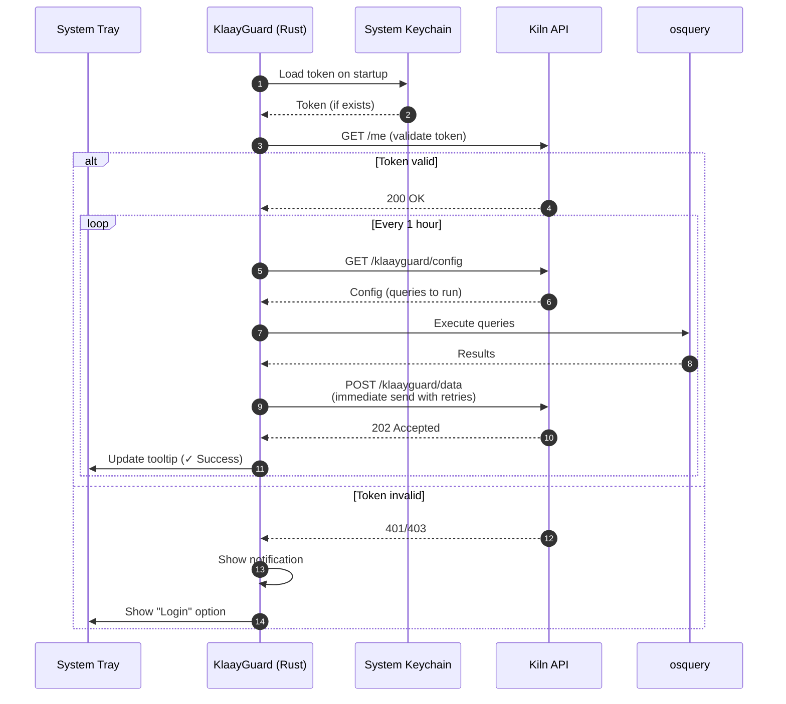

# KlaayGuard

[](https://tauri.app)

**KlaayGuard** is a lightweight system tray security monitoring application that collects system information using osquery and reports it to a centralized API for security analysis.

## 🎯 Purpose

KlaayGuard automatically:

- Collects system security data hourly (processes, network connections, installed software, etc.)
- Immediately sends data to the Kiln API with automatic retries
- Runs as a system tray-only application (no visible window)
- Provides secure authentication via deep links
- Shows status via tray icon tooltip (green = success, red = failure)
- Auto-starts on login (cannot be disabled for security)

## 🏗️ Architecture

### System Tray Only
- No visible windows or UI
- All interactions via system tray menu
- Status displayed in tooltip

### Authentication Flow
1. App starts → Check keychain for token
2. If no token: User clicks "Login" in tray menu
3. Opens browser to Earthenware login page
4. After authentication, deep link callback (`klaayguard://auth-callback?token=JWT`)
5. Token saved to system keychain

### Data Collection Flow


## 🚀 Quick Start

### Prerequisites

```bash
# Install Rust
curl --proto '=https' --tlsv1.2 -sSf https://sh.rustup.rs | sh
source ~/.cargo/env

# Install Tauri CLI
cargo install tauri-cli
```

### Development

```bash
# Clone repo
git clone https://github.com/klaayinc/klaayguard.git
cd klaayguard

# Run in development
cargo tauri dev
```

### Build

```bash
# Production build
cargo tauri build

# Platform-specific builds
cargo tauri build --target aarch64-apple-darwin      # macOS Apple Silicon
cargo tauri build --target x86_64-apple-darwin       # macOS Intel
cargo tauri build --target x86_64-pc-windows-msvc    # Windows
cargo tauri build --target x86_64-unknown-linux-gnu  # Linux
```

## 🔧 Configuration

### Environment Setup

KlaayGuard uses environment files for configuration management. Before building, set up your environment files:

```bash
# Copy template files
scripts/setup-env.sh

# Validate configuration
node scripts/validate-env.js
```

### Environment Variables

| Variable | Default | Description |
|----------|---------|-------------|
| `VITE_API_BASE_URL` | (required) | Kiln API base URL |
| `VITE_EARTHENWARE_URL` | (required) | Earthenware login URL |
| `KLAAYGUARD_COLLECTION_INTERVAL_SECONDS` | `3600` | Collection interval (1 hour) |
| `VITE_SENTRY_DSN` | (empty) | Sentry error tracking DSN |

### Environment Files

- `.env.defaults` - Safe defaults (committed)
- `.env.development` - Development configuration
- `.env.staging` - Staging configuration
- `.env.production` - Production configuration
- `.env.*.local` - Local overrides (not committed)

For detailed configuration instructions, see [docs/ENVIRONMENT.md](docs/ENVIRONMENT.md)

### API Endpoints

- **Config**: `GET /klaayguard/config` - Fetch monitoring configuration (queries to run)
- **Data**: `POST /klaayguard/data` - Submit collected system data immediately
- **Me**: `GET /me` - Validate authentication token

## 📁 Project Structure

```
klaayguard/
├── src-tauri/           # Rust backend (Tauri)
│   ├── src/
│   │   ├── lib.rs       # Main application logic
│   │   ├── main.rs      # Entry point
│   │   └── keychain.rs  # Secure token storage
│   ├── vendor/
│   │   └── osqueryi     # osquery binary (bundled)
│   ├── Cargo.toml       # Rust dependencies
│   └── tauri.conf.json  # Tauri configuration
├── icons/               # System tray icons
└── VERSION              # Single source of truth for versioning
```

## 🔒 Security Features

- **JWT Authentication**: Secure API communication via system keychain
- **System Tray Only**: No visible window to prevent user interference
- **Auto-Start**: Automatic startup on login (mandatory, cannot be disabled)
- **Auto-Update**: Automatic security patch installation
- **Deep Link Auth**: Secure token delivery from Earthenware
- **Retry Logic**: Automatic retry with exponential backoff (3 attempts)
- **No Local Storage**: Data sent immediately (no local persistence)

## 🔄 Auto-Start

KlaayGuard uses `tauri-plugin-autostart` for cross-platform auto-start:

- **macOS**: LaunchAgent (runs on login)
- **Windows**: Registry startup entry
- **Linux**: XDG autostart desktop entry

The app automatically configures itself to start on login. This ensures continuous security monitoring.

## 📊 Status Indicators

The system tray icon tooltip shows the status:

- **"✓ Last send: [timestamp] (Success)"** - Data successfully sent
- **"✗ Last send: Failed"** - Data send failed (will retry in 1 hour)
- **"KlaayGuard - Security Monitoring"** - Default status

On failure, a system notification appears with details.

## 🛠️ Development Commands

```bash
# Setup environment files (first time only)
scripts/setup-env.sh

# Development (with local API)
bin/dev

# Build for specific environment
bin/build development
bin/build staging
bin/build production

# Validate environment configuration
node scripts/validate-env.js

# Check code
cargo check --manifest-path=src-tauri/Cargo.toml

# Run tests
cargo test --manifest-path=src-tauri/Cargo.toml
```

## 📦 Dependencies

### Core
- **Tauri 2.0**: Desktop app framework
- **reqwest**: HTTP client
- **reqwest-middleware**: Retry logic with exponential backoff
- **tokio**: Async runtime
- **serde**: Serialization
- **chrono**: Timestamps

### Plugins
- **tauri-plugin-shell**: Execute osquery binary
- **tauri-plugin-notification**: System notifications
- **tauri-plugin-autostart**: Auto-start on login
- **tauri-plugin-opener**: Open browser for login
- **tauri-plugin-single-instance**: Prevent duplicate instances

### Platform-Specific
- **keyring**: Secure token storage (system keychain)
- **sentry**: Error tracking and monitoring

## 🏗️ Multi-Platform Support

### Windows
- System tray icon with menu
- Registry-based auto-start
- osquery bundled as sidecar

### macOS
- System tray icon (template mode for dark/light)
- LaunchAgent for auto-start
- Keychain for secure token storage
- osquery bundled as sidecar

### Linux
- System tray icon (requires GTK)
- XDG autostart
- osquery bundled as sidecar

## 📄 Version Management

- **VERSION file**: Single source of truth (e.g., `0.1.12`)
- **Automatic sync**: Run `yarn sync-version` or `node scripts/sync-version.js`
- Syncs: `package.json`, `tauri.conf.json`, `Cargo.toml`

## 🤝 Contributing

1. Fork the repository
2. Create a feature branch
3. Make your changes
4. Test on target platforms
5. Submit a pull request

## 📄 License

[Add your license information here]
