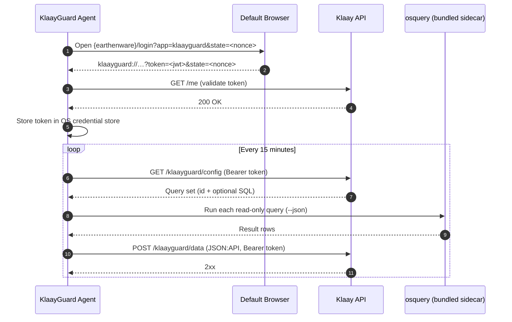

# KlaayGuard

[](https://tauri.app)

**KlaayGuard** is a tray-only desktop agent, written in Rust on Tauri 2. It
collects security-posture telemetry with a bundled copy of
[osquery](https://osquery.io) and reports it to the Klaay API every 15 minutes.
It has no window and no web frontend.

Documentation:

- [Overview](docs/OVERVIEW.md) — what the agent does, in full
- [Employee Guide](docs/EMPLOYEE_GUIDE.md) — plain-language page for end users
- [Privacy Datasheet](docs/PRIVACY_DATASHEET.md) — exact data scope
- [Sentry Setup](docs/SENTRY_SETUP.md) — crash reporting

## How it works



Key properties:

- **The server defines the queries.** The agent has no hardcoded query list.
  A safety gate accepts only a single read-only `SELECT` or `WITH` statement.
- **No local database.** Rows go directly from osquery to the POST. Nothing
  is buffered on disk.
- **Retries:** on `429`, `5xx`, or network errors the agent retries after
  60 s, then 120 s. A `401`/`403` clears the in-memory token and prompts
  sign-in instead.
- **osquery is bundled.** `osqueryi` ships as a Tauri sidecar. The agent never
  installs osquery on the machine and needs no admin rights to run.
- **Tray only.** The menu shows sign-in state (green/red dot), a countdown to
  the next fetch, and an Employee Hub link. There is no Quit and no Sign-out
  item, by design.

## Download

Signed builds are published on the
[GitHub releases page](https://github.com/klaayinc/klaayguard/releases).
Each release carries three variants — `development`, `staging`, `production` —
that differ only in their baked-in URLs. Asset naming:

```
KlaayGuard_<version>_<macOS_arm64|macOS_x64|Linux_x86_64>_<variant>.<ext>
```

- **macOS:** `.dmg` (drag to Applications) and `.pkg` installer (preferred,
  see below). Apple Silicon and Intel are separate builds.
- **Linux:** `.deb`, `.rpm`, and `.AppImage`.
- **Windows:** the NSIS installer is configured, but the release job is
  currently disabled. No Windows build is distributed.

## Build from source

### Prerequisites

KlaayGuard is Rust only — no Node.js or frontend toolchain.

```bash
# Install Rust
curl --proto '=https' --tlsv1.2 -sSf https://sh.rustup.rs | sh
source ~/.cargo/env

# Install the Tauri CLI (Rust, not npm)
cargo install tauri-cli --version "^2"

# Ruby/rake (for vendoring the osquery sidecars) — preinstalled on macOS
```

### Setup and build

```bash
git clone https://github.com/klaayinc/klaayguard.git
cd klaayguard

# Vendor the osquery sidecars (once). Downloads osquery 5.18.1 from the
# official GitHub release and verifies SHA-256 digests.
rake

# Default environment is production
cargo tauri build

# Staging/development overrides (env feeds the build script defaults)
KLAAY_ENV=staging cargo tauri build
KLAAY_ENV=development cargo tauri build

# Platform targets
cargo tauri build --target aarch64-apple-darwin      # macOS Apple Silicon
cargo tauri build --target x86_64-apple-darwin       # macOS Intel
cargo tauri build --target x86_64-unknown-linux-gnu  # Linux
```

Run against a local stack (kiln on :3000, earthenware on :5173):

```bash
KLAAY_ENV=development VITE_API_BASE_URL=http://localhost:3000 VITE_EARTHENWARE_URL=http://localhost:5173 \
  cargo tauri build && open src-tauri/target/release/bundle/macos/KlaayGuard.app
```

### macOS installer (`.pkg`) vs disk image (`.dmg`)

The release pipeline ships **both** a drag-to-Applications `.dmg` and a
double-click `.pkg` installer. The installer is preferred for first-time setup:
its `postinstall` script ([`src-tauri/macos/scripts/postinstall`](src-tauri/macos/scripts/postinstall))
registers the launchd LaunchAgent **at install time**, so auto-start and the
`KeepAlive` auto-restart are active immediately — the user never has to
launch the app first. (The DMG relies on the app installing its own agent on
first launch, which is skipped if the user drags it to /Applications but never
opens it.)

The postinstall reuses the app's own logic through the `--install-agent` CLI
seam rather than re-implementing `launchctl` in shell; the app still
self-installs the agent on launch as an idempotent fallback. The in-app
auto-updater always uses the `.dmg` (the agent is already running during an
update, so the first-launch gap does not apply).

Building the signed installer requires a **Developer ID Installer** identity
(separate from the Developer ID Application cert used to codesign the `.app`),
provided to CI as the `APPLE_INSTALLER_CERTIFICATE` /
`APPLE_INSTALLER_CERTIFICATE_PASSWORD` secrets. Until those are configured the
`.pkg` step is skipped and only the `.dmg` ships. Build one locally with:

```bash
# after `cargo tauri build` has produced KlaayGuard.app
INSTALLER_SIGNING_IDENTITY="Developer ID Installer: …" \
  src-tauri/scripts/build-macos-pkg.sh \
  src-tauri/target/release/bundle/macos/KlaayGuard.app "$(cat VERSION)" KlaayGuard.pkg
```

## Configuration

### Environments

`KLAAY_ENV` selects the environment at build time. `src-tauri/build.rs` bakes
the matching URLs in as compile-time defaults:

| Environment | API | Web app |
|---|---|---|
| `production` (default) | `https://api.klaay.com` | `https://app.klaay.com` |
| `staging` | `https://api.klaay.dev` | `https://app.klaay.dev` |
| `development` | `http://localhost:3000` | `http://localhost:5173` |

At runtime, an environment variable overrides the baked-in default. The final
fallback is production.

### Environment variables

All variables are optional.

| Variable | Default | Purpose |
|---|---|---|
| `KLAAY_ENV` | `production` | Selects build environment; also the Sentry environment tag |
| `VITE_API_BASE_URL` | per environment | Klaay API base URL |
| `VITE_EARTHENWARE_URL` | per environment | Web app URL for sign-in and Employee Hub |
| `VITE_SENTRY_DSN` | empty (Sentry off) | Sentry DSN; CI injects it for releases |
| `KLAAYGUARD_COLLECTION_INTERVAL_SECONDS` | `900` | Collection loop interval |
| `KLAAYGUARD_UPDATE_INTERVAL_SECONDS` | `21600` | Update check interval (macOS) |
| `KLAAYGUARD_FAILURE_FOCUS_DEBOUNCE_SECONDS` | `60` | Minimum gap between sign-in nudges |

### API endpoints

| Call | Purpose | Auth |
|---|---|---|
| `GET /me` | Validate a token from a deep link | Bearer |
| `GET /klaayguard/config` | Fetch the query set | Bearer |
| `POST /klaayguard/data` | Send collected rows | Bearer |
| `GET /klaayguard/updates/latest` | Update manifest | none |
| `GET /klaayguard/download/{asset_id}` | Update DMG | none |

## Automatic startup on macOS

KlaayGuard registers a user-level LaunchAgent at
`~/Library/LaunchAgents/com.klaay.klaayguard.plist` and launchd keeps it
running with `KeepAlive`.

- The app installs the agent on every launch (idempotent); the `.pkg`
  postinstall registers it at install time.
- Auto-start cannot be disabled. This keeps monitoring continuous.
- The agent is per-user. It runs only while that user is logged in.
- The `bootstrap` step is skipped when the app is not under `/Applications`.
  Launch from `/Applications`, not from Downloads.

## Automatic updates (macOS)

The agent checks `GET /klaayguard/updates/latest` at startup and then every
6 hours. Before it installs a newer version, it verifies the download three
ways:

1. SHA-256 hash against the release manifest.
2. `codesign --verify` plus the Klaay Apple Team ID on the leaf certificate.
3. `spctl --assess` (Gatekeeper / notarization).

If any check fails, the running agent stays untouched. On success the agent
replaces `/Applications/KlaayGuard.app` and restarts itself. Updates never
change the data-collection scope; the server config governs that.

## Version management and releases

- CI computes the next version by bumping the patch of the latest published
  release tag (`.github/workflows/_prepare-release.yml`). The `VERSION` file
  is the baseline only when no release exists yet.
- The release workflow writes the version into `src-tauri/tauri.conf.json`
  and `src-tauri/Cargo.toml` before building.
- Every push to `main` or `dev` builds all variants and uploads them to a
  draft release. On `main`, the draft is published and marked latest after
  all platform builds succeed. The update endpoint serves the latest release.

## Error monitoring

The Rust process reports crashes and lifecycle events to Sentry when the
`VITE_SENTRY_DSN` environment variable is set at process start.
`send_default_pii` is off: crash telemetry carries no user data and no
collected osquery data. Note: released builds currently start without a DSN,
so Sentry is off in production — see the note in
[docs/SENTRY_SETUP.md](docs/SENTRY_SETUP.md).

## Logs

- App log: `~/Library/Logs/com.klaay.app/KlaayGuard.log`
- launchd stdout/stderr: `~/Library/Logs/KlaayGuard/klaayguard.log` and
  `klaayguard.error.log`

## Contributing

1. Create a feature branch.
2. Make your changes and test on the target platforms.
3. Open a pull request against `main`.
