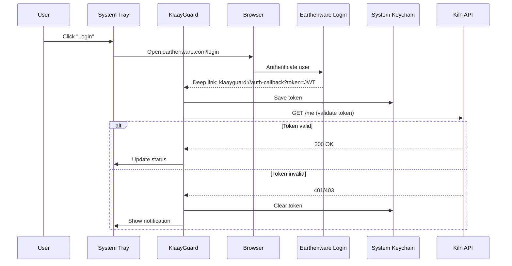
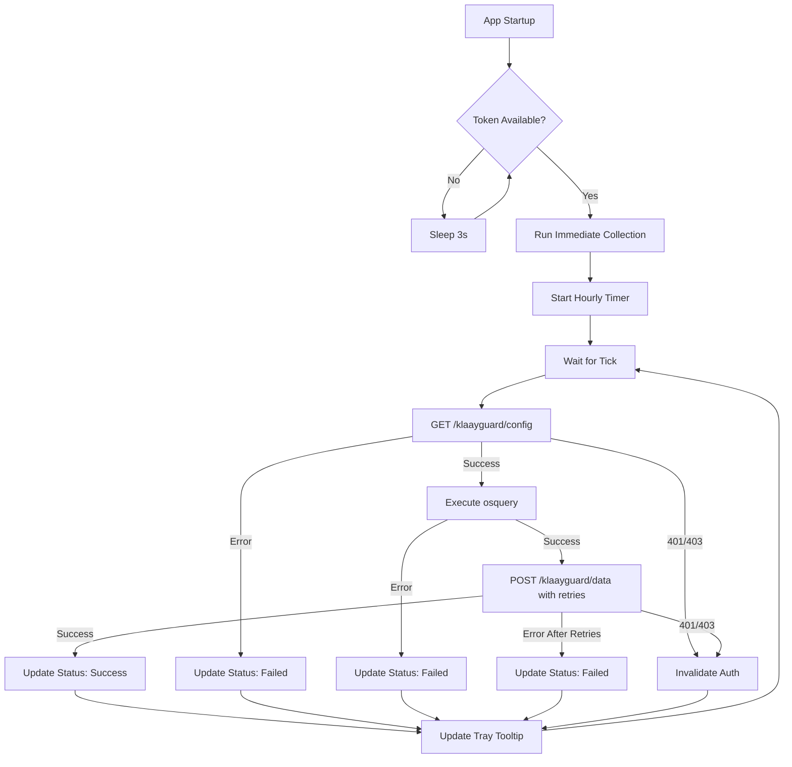
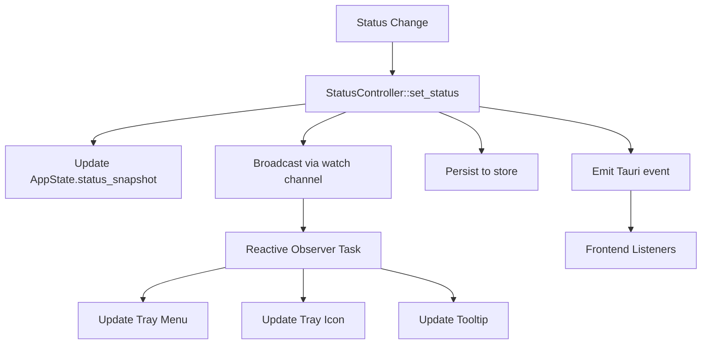

# KlaayGuard Architecture

## Overview

KlaayGuard is a **system tray-only** security monitoring application built with Tauri and Rust. It runs as a background service that collects system information via osquery and reports it to the Kiln API.

## Design Principles

1. **Minimal UI**: System tray icon only - no windows or visible interface
2. **Immediate Delivery**: Data sent immediately after collection with automatic retries
3. **Security First**: Cannot be easily disabled, auto-starts on login
4. **Simplicity**: Single background loop, no local persistence
5. **Reliability**: Exponential backoff retry mechanism for API failures

## Architecture Diagram

```
┌─────────────────────────────────────────────────────────┐
│                   System Tray Menu                      │
│  ┌──────────────────────────────────────────────────┐   │
│  │  🔒 Login                                        │   │
│  │  ℹ️  Status: Last send successful               │   │
│  └──────────────────────────────────────────────────┘   │
└────────────────────┬────────────────────────────────────┘
                     │
          ┌──────────▼──────────┐
          │   KlaayGuard Rust   │
          │   (Tauri Backend)   │
          └──────────┬──────────┘
                     │
    ┌────────────────┼────────────────┐
    │                │                │
    ▼                ▼                ▼
┌────────┐    ┌──────────┐    ┌──────────┐
│Keychain│    │  osquery │    │ Kiln API │
│(Token) │    │(Sidecar) │    │  (REST)  │
└────────┘    └──────────┘    └──────────┘
```

## Components

### 1. System Tray

**Location**: `src-tauri/src/lib.rs` - `run()` function

**Responsibilities**:
- Display application icon in system tray
- Show menu with "Login" option
- Update tooltip with status (✓ Success / ✗ Failed)
- Handle menu item clicks

**Key Features**:
- Template icon mode (adapts to light/dark theme on macOS)
- No quit option (security requirement)
- Status displayed in tooltip
- Opens browser for authentication

### 2. Authentication System

**Location**: `src-tauri/src/lib.rs` + `src-tauri/src/keychain.rs`

**Flow**:



**Components**:
- `handle_deep_link_url()`: Parses authentication callback
- `save_auth_token()`: Stores JWT in system keychain
- `get_auth_status()`: Validates token with `/me` endpoint
- `invalidate_auth()`: Clears invalid tokens

**Security**:
- Tokens stored in OS keychain (macOS Keychain, Windows Credential Manager)
- Automatic token validation on startup
- Token refresh on 401/403 responses

### 3. Data Collection Loop

**Location**: `src-tauri/src/lib.rs` - `spawn_background_loop()` and `run_cycle()`

**Flow**:



**Interval**: 3600 seconds (1 hour)

**Steps**:
1. **Wait for Authentication**: Loop until token is available
2. **Fetch Configuration**: `GET /klaayguard/config` - returns list of queries
3. **Execute Queries**: Run osquery commands via sidecar binary
4. **Send Data**: `POST /klaayguard/data` with JSON:API format
5. **Update Status**: Update tray tooltip and send notifications

**Error Handling**:
- API failures: 3 retries with exponential backoff (60s to 600s)
- Authentication failures: Invalidate token, show notification
- osquery errors: Log to Sentry, update status to failed

### 4. Retry Mechanism

**Location**: `src-tauri/src/lib.rs` - Uses `reqwest-middleware` + `reqwest-retry`

**Configuration**:
```rust
let retry_policy = ExponentialBackoff::builder()
    .retry_bounds(Duration::from_secs(60), Duration::from_secs(600))
    .build_with_max_retries(3);
```

**Behavior**:
- Initial retry: 60 seconds
- Second retry: 120 seconds
- Third retry: 240 seconds
- Max retry: 600 seconds (10 minutes)
- Total attempts: 3

**Retry Conditions**:
- Network errors (timeouts, connection failures)
- HTTP 5xx errors (server errors)
- HTTP 429 (rate limiting)

**Non-Retry Conditions**:
- HTTP 401/403 (authentication errors - token invalidated instead)
- HTTP 4xx (client errors other than 429)
- JSON parsing errors

### 5. osquery Integration

**Location**: `src-tauri/src/lib.rs` - `execute_query()` and `execute_sql_batch()`

**Sidecar Binary**:
- Platform-specific osquery binaries bundled in `src-tauri/vendor/`
- Named pattern: `osqueryi-{arch}-{platform}`
- Examples:
  - `osqueryi-aarch64-apple-darwin` (macOS ARM64)
  - `osqueryi-x86_64-apple-darwin` (macOS Intel)
  - `osqueryi-x86_64-unknown-linux-gnu` (Linux x86_64)
  - `osqueryi-x86_64-pc-windows-msvc.exe` (Windows x86_64)

**Execution**:
```rust
let cmd = app
    .shell()
    .sidecar("osqueryi")
    .unwrap()
    .args(["--json", "SELECT * FROM hardware_info"]);

let output = cmd.output().await?;
```

**Query Format**:
- Config from API specifies queries to run
- Each query has a logical ID and SQL statement
- Results returned as JSON arrays

**Error Handling**:
- Missing tables/columns: Return empty array
- Parse errors: Log to Sentry
- Execution failures: Propagate error

### 6. State Management

**Location**: `src-tauri/src/lib.rs` - `AppState` struct

**Fields**:
```rust
pub struct AppState {
    pub auth_token: RwLock<Option<String>>,
    pub api_base_url: RwLock<String>,
    pub last_send_status: RwLock<Option<bool>>,
    pub last_send_at: RwLock<Option<chrono::DateTime<chrono::Utc>>>,
    pub keychain_cleared_this_session: RwLock<bool>,
    pub status_sender: RwLock<Option<watch::Sender<StatusSnapshot>>>,
    pub status_snapshot: RwLock<Option<StatusSnapshot>>,
}
```

**Access Pattern**:
- Shared via `Arc<AppState>`
- Thread-safe with `RwLock`
- Accessed from multiple background tasks

**State Updates**:
- `auth_token`: Updated on login, cleared on logout/invalidation
- `api_base_url`: Set on startup from env vars
- `last_send_status`: Updated after each data send attempt
- `last_send_at`: Updated with timestamp of last send
- `keychain_cleared_this_session`: Prevents repeated keychain prompts
- `status_sender`: Watch channel sender for reactive status updates
- `status_snapshot`: Latest status snapshot for immediate reads

### 6.1. Unified Status Management

**Location**: `src-tauri/src/status.rs`

**Purpose**: Single source of truth for application status, ensuring all UI components (tray icon, tooltip, context menu) stay synchronized.

**Status Enum**:
```rust
pub enum AgentStatus {
    Unauthenticated,
    Authenticating,
    Ready { last_success: Option<DateTime<Utc>> },
    SendFailed { error: String, last_attempt: DateTime<Utc> },
}
```

**StatusSnapshot**:
- Contains current `AgentStatus`, API URL, and timestamp
- Provides methods for UI rendering:
  - `tray_icon()`: Returns icon filename based on status
  - `tray_tooltip()`: Returns tooltip text
  - `menu_status_text()`: Returns context menu status text
  - `is_operational()`: Checks if agent is ready

**Reactive Updates**:
- Uses `tokio::sync::watch::channel` for broadcasting status changes
- Single `StatusController::set_status()` method updates all state
- Reactive observer task watches status channel and updates tray UI automatically
- No manual UI update calls needed - all components react to status changes

**Status Flow**:


**Persistence**:
- Status persisted to `tauri-plugin-store` for restoration on restart
- Stored in `app_data_dir/status.json`
- Loaded on startup and broadcast to observers

**Benefits**:
- **Single Source of Truth**: All UI derives from one `StatusSnapshot`
- **Reactive**: UI updates automatically when status changes
- **Consistent**: Tray icon, tooltip, and menu always show matching status
- **Testable**: Status logic separated from UI rendering

### 7. Notification System

**Location**: `src-tauri/src/lib.rs` - Uses `tauri-plugin-notification`

**Triggers**:
- Authentication failure: "Authentication required. Please sign in."
- Data send failure: "Data send failed. Will retry in 1 hour."
- Architecture mismatch: "App built for {arch} but running on {host}"

**Platform Support**:
- macOS: Native notification center
- Windows: Toast notifications
- Linux: libnotify

### 8. Auto-Start

**Location**: `src-tauri/src/lib.rs` - Uses `tauri-plugin-autostart`

**Configuration**:
```rust
.plugin(tauri_plugin_autostart::init(
    tauri_plugin_autostart::MacosLauncher::LaunchAgent,
    None::<Vec<&str>>
))
```

**Platform Mechanisms**:
- **macOS**: LaunchAgent plist in `~/Library/LaunchAgents/`
- **Windows**: Registry key in `HKEY_CURRENT_USER\Software\Microsoft\Windows\CurrentVersion\Run`
- **Linux**: Desktop entry in `~/.config/autostart/`

**Behavior**:
- Configured on first run
- Starts application on user login
- Runs in background (no window shown)

### 9. Deep Link Handling

**Location**: `src-tauri/src/lib.rs` - `handle_deep_link_url()`, `try_handle_deep_link_from_args()`

**URL Scheme**: `klaayguard://`

**Flow**:
1. User clicks "Login" in tray menu
2. Browser opens: `https://app.klaay.com/login?app=klaayguard`
3. User authenticates in Earthenware
4. Earthenware redirects: `klaayguard://auth-callback?token=JWT`
5. OS routes deep link to KlaayGuard
6. KlaayGuard parses token and saves to keychain

**Registration**:
- Declared in `src-tauri/Info.plist` for macOS
- OS registers on app installation
- Dev builds use `KlaayGuard-Dev` with identifier `com.klaay.app.dev`

**Development Mode**:
- `bin/dev` builds and installs `KlaayGuard-Dev.app` to `/Applications/`
- URL scheme registered to dev app for easy testing
- Auto-rebuilds when source changes detected

**Single Instance**:
- Uses `tauri-plugin-single-instance`
- New deep links route to existing instance
- Prevents duplicate processes

## Data Flow

### Startup Sequence

```
1. main.rs: Initialize Sentry
2. lib.rs run(): Create AppState
3. lib.rs run(): Load token from keychain
4. lib.rs run(): Create system tray
5. lib.rs run(): Spawn background loop
6. Background loop: Wait for token
7. Background loop: Run immediate collection
8. Background loop: Start hourly timer
```

### Collection Cycle

```
1. Timer tick (every 3600 seconds)
2. GET /klaayguard/config
3. Parse queries from response
4. Execute each query via osquery
5. Build JSON:API payload
6. POST /klaayguard/data (with retries)
7. Update tray status
8. Log to Sentry
```

### Authentication Flow

```
1. User clicks "Login" in tray
2. Open browser to Earthenware
3. Earthenware calls: klaayguard://auth-callback?token=JWT
4. Parse token from URL
5. Save to system keychain
6. Update AppState.auth_token
7. Emit "auth:status" event
8. Trigger immediate collection
```

## Environment Variables

### Required
None (all have defaults)

### Optional

| Variable | Default | Description |
|----------|---------|-------------|
| `VITE_API_BASE_URL` | `https://api.klaay.com` | Kiln API endpoint |
| `VITE_EARTHENWARE_URL` | `https://app.klaay.com` | Login page URL |
| `KLAAYGUARD_COLLECTION_INTERVAL_SECONDS` | `3600` | Collection frequency |
| `VITE_SENTRY_DSN` | (none) | Error tracking |

### Build-time Variables

| Variable | Description |
|----------|-------------|
| `APP_DEFAULT_API_BASE_URL` | Compiled-in API URL fallback |
| `KLAAY_ENV` | Build environment (development/staging/production) |
| `TAURI_SIGNING_PRIVATE_KEY` | Code signing key for updater |

## Build Process

### Development

```bash
# Run with local API
VITE_API_BASE_URL=http://localhost:3000 cargo tauri dev
```

### Production

```bash
# Build for production
cargo tauri build

# Platform-specific
cargo tauri build --target aarch64-apple-darwin
cargo tauri build --target x86_64-pc-windows-msvc
cargo tauri build --target x86_64-unknown-linux-gnu
```

### Environment Selection

Controlled via `scripts/tauri-build.cjs`:

```javascript
// KLAAY_ENV determines environment
// - production: https://api.klaay.com
// - staging: https://api.klaay.dev
// - development: http://localhost:3000
```

## Security Considerations

### Authentication
- JWT tokens stored in OS keychain
- Automatic token validation
- Token cleared on 401/403
- Deep link authentication prevents browser token exposure

### Process Protection
- No quit menu option
- Auto-start on login
- Background service (hidden from dock on macOS)
- Single instance enforcement

### Data Security
- TLS for all API communication
- No local data persistence (no SQLite)
- Device serial number sent as identifier
- Sentry error tracking (PII filtered)

### Architecture Detection
- Detects x86 vs ARM mismatch
- Warns user if running wrong binary
- Logs to Sentry for monitoring

## Monitoring & Observability

### Sentry Integration

**Events Tracked**:
- `auth_token_saved` - Authentication successful
- `auth_invalidated` - Token invalidated
- `collection_config_fetch_start` - Starting config fetch
- `collection_osquery_start` - Starting data collection
- `arch_mismatch` - Architecture mismatch detected

**Breadcrumbs**:
- API requests with status codes
- Authentication state changes
- Collection cycle progress
- Error details with context

**Configuration**:
```rust
let _guard = sentry::init((dsn, sentry::ClientOptions {
    release: sentry::release_name!(),
    ..Default::default()
}));
```

### Logging

**Levels**:
- `Info`: Normal operation
- `Warning`: Recoverable errors
- `Error`: Unrecoverable errors

**Destinations**:
- Console (development)
- Sentry (production)
- System logs (via `tauri-plugin-log`)

## Performance Characteristics

### Memory Usage
- ~50-100 MB baseline
- No database growth (no SQLite)
- Minimal allocations per cycle

### CPU Usage
- Idle: <1%
- During collection: 5-10% for osquery execution
- During send: <1% for network I/O

### Network Usage
- Config fetch: ~1 KB per hour
- Data send: Variable (depends on query results, typically 10-100 KB)
- Retry overhead: 3x on failures

### Disk Usage
- Binary size: ~20 MB (includes osquery sidecar)
- No database files
- Logs: Managed by system (rotated automatically)

## Platform-Specific Details

### macOS
- **Activation Policy**: `Accessory` (hidden from dock)
- **LaunchAgent**: Auto-start via `com.klaay.klaayguard.plist`
- **Keychain**: Uses macOS Keychain Services
- **Tray Icon**: Template mode for dark/light theme
- **Architecture Detection**: Warns if x86 on ARM or vice versa

### Windows
- **System Tray**: Uses Windows notification area
- **Auto-start**: Registry key in CurrentVersion/Run
- **Credential Manager**: Token storage
- **Service**: Runs as user process (not system service)

### Linux
- **System Tray**: Requires GTK
- **Auto-start**: XDG autostart desktop entry
- **Keychain**: libsecret/gnome-keyring
- **Dependencies**: gtk3, webkit2gtk

## Testing

### Manual Testing
1. Run `cargo tauri dev`
2. Click "Login" in tray
3. Authenticate in browser
4. Wait for collection (or set `KLAAYGUARD_COLLECTION_INTERVAL_SECONDS=60`)
5. Check tray tooltip for status
6. Verify data in Kiln API

### Integration Testing
- Test authentication flow
- Test data collection and send
- Test retry mechanism
- Test error handling
- Test auto-start

### Platform Testing
- Test on macOS (x86 and ARM)
- Test on Windows (x64)
- Test on Linux (x86_64)

## Troubleshooting

### Common Issues

1. **App not collecting data**:
   - Check authentication status (click tray icon)
   - Check logs for errors
   - Verify API endpoint is reachable
   - Check `VITE_API_BASE_URL` environment variable

2. **Tray icon not showing**:
   - macOS: Check if running as Accessory
   - Linux: Ensure GTK is installed
   - Windows: Check system tray settings

3. **Authentication fails**:
   - Clear keychain entry manually
   - Try logging in again
   - Check Earthenware URL is correct

4. **Architecture mismatch**:
   - Download correct binary for your platform
   - Check if running via Rosetta (macOS)

### Debug Commands

```bash
# Check if app is running
ps aux | grep -i klaayguard

# View logs (macOS LaunchAgent)
cat ~/Library/Logs/klaayguard.log

# Check keychain entry (macOS)
security find-generic-password -s klaayguard

# Kill app
pkill -f klaayguard
```

## Future Considerations

### Potential Enhancements
- [ ] Offline buffer for failed sends
- [ ] Configurable collection interval via API
- [ ] Manual sync trigger in tray menu
- [ ] Status history in tray menu
- [ ] Bandwidth monitoring
- [ ] Compression for large payloads

### Scalability
- Single background loop scales well to 1000s of devices
- API rate limiting may require adjustment
- Consider batch sending for high-frequency collection

## References

- [Tauri Documentation](https://tauri.app/)
- [osquery Documentation](https://osquery.io/)
- [Sentry Rust SDK](https://docs.sentry.io/platforms/rust/)
- [JSON:API Specification](https://jsonapi.org/)

