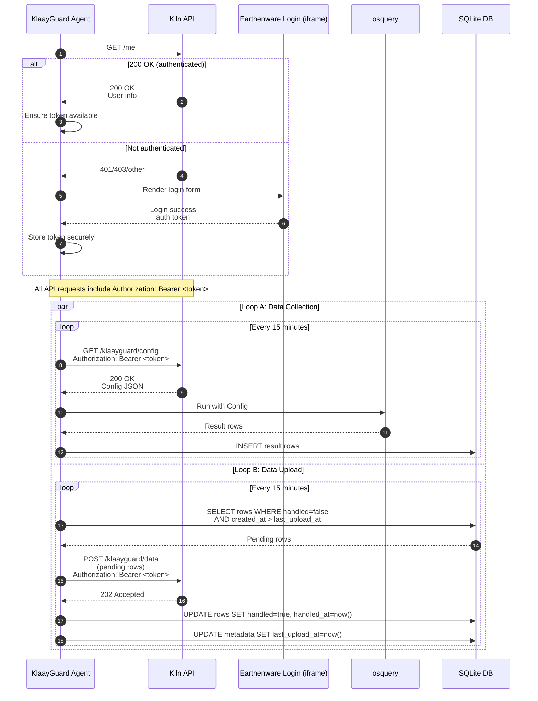

## KlaayGuard authentication, data collection, and upload sequence

The following sequence diagram documents the startup authentication check, followed by two 15-minute loops: (A) config fetch → osquery run → local store, and (B) upload pending data → mark handled. All API requests include the authentication token once obtained.

---

## Gap Analysis and Implementation Guidance

### Assumptions and Environment Targets

- React app is only for authentication (Earthenware iframe) and optional user display.
- Background data collection and upload run in Tauri irrespective of the React window.
- App must auto-start at login and keep running if closed; recover after restarts.
- Target platform (for now): macOS Apple Silicon.
- Environments and endpoints:
  - **Development**: API `http://localhost:3000`, Earthenware `http://localhost:5173`
  - **Staging**: API `https://api.klaay.dev`, Earthenware `https://app.klaay.dev`
  - **Production**: API `https://api.klaay.com`, Earthenware `https://app.klaay.com`

### Current Implementation Snapshot

- Tauri background loop (15 min) fetches config, runs bundled `osqueryi`, and persists results to a local SQLite queue (`results` table). Upload to API is deferred to Loop B.
- macOS LaunchAgent installed with `RunAtLoad` and `KeepAlive=true`; window close hides; no quit menu; duplicate instance guard; updater enabled.
- React handles iframe login and `/authenticate` POST; the iframe posts the token directly to Tauri via IPC. Tauri stores the token securely in the macOS Keychain and restores it on boot. React does not persist or read the token and instead uses a tokenless `get_auth_status` IPC.
- Endpoints provided via `VITE_API_BASE_URL` and `VITE_EARTHENWARE_URL` (used by both React and Tauri).

### Gaps and Recommendations

#### 1) Authentication and Token Management

- Status: Implemented
  - Tauri is authoritative for the auth token and stores it in the macOS Keychain
  - Token is restored at boot before background loops start
  - IPC commands: `save_auth_token`, `clear_auth_token`, `get_auth_status` (returns `{ authenticated, display_name }` without exposing the token)
  - React never persists or reads the token; the Earthenware iframe posts the token to Tauri via IPC
  - Iframe origin check uses `new URL(VITE_EARTHENWARE_URL).origin` against `event.origin`
- On 401/403 from the API, Tauri clears the token, emits `auth:invalidated`, updates `auth:status`, and brings the app window to the foreground for re‑login

#### 2) Loop A: Config → osquery → Local Store (SQLite)

- Status: Implemented
  - On each cycle, the agent GETs `/klaayguard/config` with the bearer token, runs `osqueryi` accordingly, and inserts all rows into SQLite `results` with fields: `id`, `table_name`, `json`, `run_id`, `created_at`, `handled`, `handled_at`.
  - A `run_id` (UUID) groups all rows generated in a single execution.
  - DB mode: file‑backed by default in development at `~/Library/Application Support/com.klaay.app/klaayguard.db`; optional memory mode via `KLAAYGUARD_DB_MODE=memory`.
  - Non‑overlapping 15‑minute scheduler; emits `collection:success` with `{ run_id, inserted_rows }`.
  - On 401/403 during config fetch, the token is cleared and the app focuses for re‑login (cycle aborts).

#### 3) Loop B: Upload Pending → Mark Handled → Update last_upload_at

- Expected: Every cycle, select pending rows (`handled=false` and `created_at > last_upload_at`), POST, mark handled, update `last_upload_at`.
- Current: Queue exists and is being populated by Loop A; uploader not implemented yet; `metadata.last_upload_at` not set.
- Gaps: Idempotent upload, partial‑batch handling, retry/backoff logic are pending.
- Recommendations:
  - Implement a separate uploader that drains batches from SQLite, marks handled in a transaction, and sets `metadata.last_upload_at=now()`
  - Add exponential backoff on transient failures; never drop data

#### 4) Background Execution and System Sleep

- Expected: Runs without UI; robust to sleep/wake.
- Current: Runs in Tauri without UI; during sleep, timers pause and resume on wake. Queue is present (SQLite `results`), so data accumulates durably while offline.
- Gaps: Backlog drain/upload strategy depends on Loop B implementation.
- Recommendations: Drain backlog on wake/start via Loop B; optionally assert power during active runs (advanced macOS) if necessary.

#### 5) Environment Management (Dev/Staging/Prod)

- Expected: Distinct API and Earthenware URLs per environment; both layers aligned.
- Current: Uses `VITE_API_BASE_URL` and `VITE_EARTHENWARE_URL`; no central environment switch or validation.
- Gaps: Possible mismatch between React and Tauri if env vars diverge.
- Recommendations: Provide `.env.development`, `.env.staging`, `.env.production`; optionally add `VITE_ENVIRONMENT`; expose active URLs from Tauri to React and warn if mismatched.

#### 6) Tauri Autostart and Process Management

- Expected: Auto-start and keep running; lean on native mechanisms.
- Current: LaunchAgent (`RunAtLoad`, `KeepAlive=true`), hide-on-close, no Quit menu, duplicate-instance guard, updater.
- Gaps: None critical; optional use of `tauri-plugin-autostart` if cross-platform needed.
- Recommendations: Keep LaunchAgent; optionally add `StartInterval` as a safety net; continue using in-process tokio interval for 15-minute cadence.

#### 7) Apple Silicon Targeting

- Expected: Build for macOS Apple Silicon only (for now).
- Current: Bundled `osqueryi` and generic targets; CI may build wider.
- Gaps: Ensure release targeting is restricted in CI and binary matches architecture.
- Recommendations: Gate CI to `aarch64-apple-darwin`; validate bundled `osqueryi`.

#### 8) Security and Robustness Notes

- Token exposure: Prefer Keychain persistence and avoid re-exposing raw token to React; expose `authenticated` flag and display info.
- Iframe origin checks: Compare `new URL(VITE_EARTHENWARE_URL).origin` with `event.origin` to avoid subtle mismatches.
- Observability: Add structured logs and Sentry breadcrumbs in Tauri for config/collect/upload stages, including status codes and retry counts.

### Status Summary & Next Steps

- Token storage and boot‑time restore are implemented; 401/403 invalidation focuses the app for re‑login.
- SQLite queue is implemented (`results` now populated on every cycle). Add `metadata.last_upload_at` during Loop B.
- Next: Implement Loop B uploader with mark‑as‑handled and retry/backoff.
- Ensure `.env.*` alignment for API/Earthenware; keep loops and auth strictly in Tauri.
- Accept OS sleep; backlog will be drained once Loop B lands. LaunchAgent remains as is; Apple Silicon targeting unchanged.
