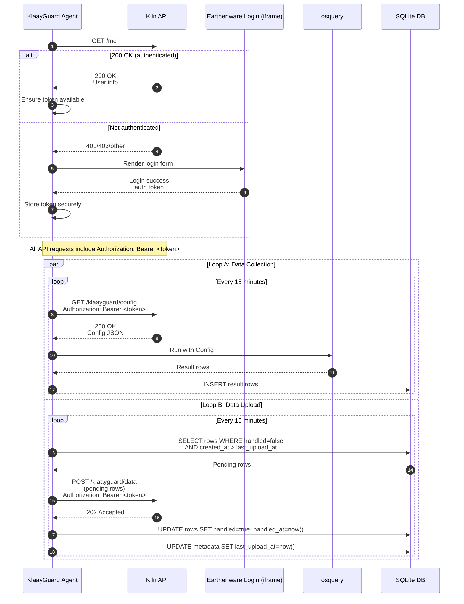

## KlaayGuard authentication, data collection, and upload sequence

The following sequence diagram documents the startup authentication check, followed by two 15-minute loops: (A) config fetch → osquery run → local store, and (B) upload pending data → mark handled. All API requests include the authentication token once obtained.

---

## Gap Analysis and Implementation Guidance

### Assumptions and Environment Targets

- React app is only for authentication (Earthenware iframe) and optional user display.
- Background data collection and upload run in Tauri irrespective of the React window.
- App must auto-start at login and keep running if closed; recover after restarts.
- Primary delivery target: macOS Apple Silicon.
- Additional supported builds (see Build Targets & Sidecars): macOS Intel (x86_64) and Linux x86_64 (glibc). Blocked targets pending sidecar packaging: Linux aarch64, Windows (x86_64/arm64).
- Environment overlays: `KLAAY_ENV` selects development/staging/production. Build overlays use `src-tauri/tauri.development.json` and `src-tauri/tauri.staging.json`; defaults for `VITE_API_BASE_URL` and `VITE_EARTHENWARE_URL` are set in `scripts/tauri-build.cjs` per environment.
  - CI/CD: GitHub Actions builds all three environments using the env-aware wrapper (`yarn tauri:build`) with `KLAAY_ENV` and passes per-environment URLs; see `.github/workflows/release.yml`.
- Environments and endpoints:
  - **Development**: API `http://localhost:3000`, Earthenware `http://localhost:5173`
  - **Staging**: API `https://api.klaay.dev`, Earthenware `https://app.klaay.dev`
  - **Production**: API `https://api.klaay.com`, Earthenware `https://app.klaay.com`

### Current Implementation Snapshot

- Loop A: Tauri background loop (15 min) fetches config, runs bundled `osqueryi`, and persists results to a local SQLite queue (`results` table).
- Loop B: Background uploader implemented. Drains pending rows and advances a `last_upload_at` watermark in `metadata` after successful upload.
- macOS LaunchAgent installed with `RunAtLoad`, `KeepAlive=true`, and `StartInterval=300s` safety net; idempotent installer (content-aware) reloads on change; window close hides; no quit menu; duplicate instance guard; updater enabled.
- React handles iframe login and `/authenticate` POST; the iframe posts the token directly to Tauri via IPC. Tauri stores the token securely in the macOS Keychain and restores it on boot. React does not persist or read the token and instead uses a tokenless `get_auth_status` IPC.
- Endpoints provided via `VITE_API_BASE_URL` and `VITE_EARTHENWARE_URL` (used by both React and Tauri).
- Environment defaults and overlays: `scripts/tauri-build.cjs` injects sane defaults for `VITE_*` per `KLAAY_ENV` and selects per-env Tauri overlays (`tauri.staging.json`, `tauri.development.json`). `tauri.no-updater.json` disables updater artifacts when signing keys are not present.
- Sidecar packaging: `rake` populates `src-tauri/vendor/osqueryi-<triple>`; `tauri.conf.json` lists it under `bundle.externalBin` so the correct platform-specific binary is bundled.
- Updater behavior: updater artifacts are produced when signing key is present; unsigned local builds skip updater artifacts via override config.

### Gaps and Recommendations

#### 1) Authentication and Token Management

- Status: Implemented
  - Tauri is authoritative for the auth token and stores it in the macOS Keychain
  - Token is restored at boot before background loops start
  - IPC commands: `save_auth_token`, `clear_auth_token`, `get_auth_status` (returns `{ authenticated, display_name }` without exposing the token)
  - React never persists or reads the token; the Earthenware iframe posts the token to Tauri via IPC
  - Iframe origin check uses `new URL(VITE_EARTHENWARE_URL).origin` against `event.origin`
- On 401/403 from the API, Tauri clears the token, emits `auth:invalidated`, updates `auth:status`, and brings the app window to the foreground for re‑login

#### 2) Loop A: Config → osquery → Local Store (SQLite)

- Status: Implemented
  - On each cycle, the agent GETs `/klaayguard/config` with the bearer token, runs `osqueryi` accordingly, and inserts all rows into SQLite `results` with fields: `id`, `table_name`, `json`, `run_id`, `created_at`, `handled`, `handled_at`.
  - A `run_id` (UUID) groups all rows generated in a single execution.
  - DB mode: file‑backed by default in development at `~/Library/Application Support/com.klaay.app/klaayguard.db`; optional memory mode via `KLAAYGUARD_DB_MODE=memory`.
  - Non‑overlapping 15‑minute scheduler; emits `collection:success` with `{ run_id, inserted_rows }`.
  - On 401/403 during config fetch, the token is cleared and the app focuses for re‑login (cycle aborts).

#### 3) Loop B: Upload Pending → Mark Handled → Update last_upload_at

- Status: Implemented

  - Separate uploader task with immediate drain on startup and a 15‑minute interval (`KLAAYGUARD_UPLOAD_INTERVAL_SECONDS`), guarded to avoid overlap.
  - Selects pending rows with `handled = false AND created_at > last_upload_at`, ordered by `created_at` asc, limited by `KLAAYGUARD_UPLOAD_MAX_ROWS` (default 1000).
  - POSTs to `POST /klaayguard/data` with `Authorization: Bearer <token>` and payload `{ device_id, batch_id, rows[] }` where each row includes `id, table_name, json, run_id, created_at`.
  - On `202 Accepted` (or generally success), marks posted rows `handled=true, handled_at=now()` and advances `metadata.last_upload_at` to `MAX(created_at)` of the handled set in a single transaction.
  - Emits UI events: `upload:success` on success; `upload:error` with `{ stage, status }` on errors.
  - On `401/403`, clears token from Keychain, emits `auth:invalidated` and `auth:status`, and focuses/shows the app for re‑login. No rows are marked in this case.

- Remaining gaps / enhancements:
  - Payload size cap and payload splitting by bytes (currently only row‑count cap).
  - Rate‑limit and transient error exponential backoff with jitter (currently retries next interval).
  - Optional per‑row acceptance handling if server returns granular statuses (currently marks all on success).
  - Optional macOS native wake listener for even faster detection (monotonic wake detection is implemented).

#### 4) Background Execution and System Sleep

- Status: Implemented
  - Headless background operation in Tauri; Loops A and B are independent of window state (window close hides to tray only).
  - Monotonic wake‑gap detection: each loop infers system wake when elapsed since last tick exceeds `KLAAYGUARD_WAKE_GAP_SECONDS` (default 300s) and emits `system:wake_detected` with `{ loop: "upload" | "collection" }`.
  - Post‑wake catch‑up: Loop B performs an immediate extra drain after a detected wake, then resumes normal cadence; Loop A proceeds on its next scheduled tick.
  - Focus on failure: Any error in either loop triggers the app window to show and focus, debounced by `KLAAYGUARD_FAILURE_FOCUS_DEBOUNCE_SECONDS` (default 60s). Event `focus:on_failure` is emitted when focusing occurs.
  - 401/403 handling unchanged: token cleared, `auth:invalidated` + `auth:status` emitted, and window focused for re‑login.
  - Structured events: `collection:attempt`, `collection:success`, `collection:error`; `upload:success`, `upload:error`; `system:wake_detected`; `focus:on_failure`.

#### 5) Environment Management (Dev/Staging/Prod)

- Status: Implemented

- Expected: Distinct API and Earthenware URLs per environment; both layers aligned.
- Current: `KLAAY_ENV` drives environment selection; `scripts/tauri-build.cjs` selects per-env Tauri overlays and injects default `VITE_API_BASE_URL`/`VITE_EARTHENWARE_URL` when missing. CI builds development/staging/production and passes `KLAAY_ENV` plus per-env URL matrix. README includes an environment matrix and `.env.*` examples.
- Gaps: Minor — no runtime validation/telemetry of resolved URLs; potential mismatch warnings are not surfaced yet.
- Recommendations: Keep `.env.development`, `.env.staging`, `.env.production` as documented in README. Optionally expose resolved URLs from Tauri to React and warn if mismatched; add startup logs/telemetry of resolved URLs.

#### 6) Tauri Autostart and Process Management

- Status: Implemented

- Expected: Auto-start and keep running; lean on native mechanisms.
- Current: LaunchAgent (`RunAtLoad`, `KeepAlive=true`, `StartInterval=300s`), hide-on-close, no Quit menu, duplicate-instance guard, updater. Installer is idempotent: compares existing plist content and reloads only when changed.
- Gaps: None critical; optional use of `tauri-plugin-autostart` for Windows/Linux if cross-platform autostart is later required.
- Recommendations: Keep LaunchAgent as the macOS source of truth; keep `StartInterval` enabled as a crash safety net; continue using in-process tokio intervals for 15-minute cadence.

#### 7) Apple Silicon Targeting

- Expected: Build for macOS Apple Silicon only (for now).
- Current: Bundled `osqueryi` sidecars cover macOS Apple Silicon, macOS Intel, and Linux x86_64 (glibc). See "Build Targets & Sidecars" for full matrix.
- Gaps: Ensure release distribution policy aligns with matrix (primary delivery macOS arm64); restrict CI artifacts where desired; ensure sidecar availability for any additional targets before enabling.
- Recommendations: Gate CI to `aarch64-apple-darwin` for primary releases; optionally produce macOS Intel and Linux x86_64 artifacts; validate bundled sidecars post-build.

#### 8) Security and Robustness Notes

- Token exposure: Prefer Keychain persistence and avoid re-exposing raw token to React; expose `authenticated` flag and display info.
- Iframe origin checks: Compare `new URL(VITE_EARTHENWARE_URL).origin` with `event.origin` to avoid subtle mismatches.
- Observability: Add structured logs and Sentry breadcrumbs in Tauri for config/collect/upload stages, including status codes and retry counts.

#### 9) Build Targets & Sidecars

- Supported build targets are constrained by availability of the `osqueryi` sidecar bundled via `bundle.externalBin`:

  | OS            | CPU     | Rust target triple        | Sidecar packaged                          | Notes                       |
  | ------------- | ------- | ------------------------- | ----------------------------------------- | --------------------------- |
  | macOS         | arm64   | aarch64-apple-darwin      | Yes (`osqueryi-aarch64-apple-darwin`)     | Primary delivery target     |
  | macOS         | x86_64  | x86_64-apple-darwin       | Yes (`osqueryi-x86_64-apple-darwin`)      | Supported                   |
  | Linux (glibc) | x86_64  | x86_64-unknown-linux-gnu  | Yes (`osqueryi-x86_64-unknown-linux-gnu`) | Supported                   |
  | Linux (glibc) | aarch64 | aarch64-unknown-linux-gnu | No                                        | Blocked until sidecar added |
  | Windows       | x86_64  | x86_64-pc-windows-msvc    | No                                        | Blocked until sidecar added |
  | Windows       | arm64   | aarch64-pc-windows-msvc   | No                                        | Blocked until sidecar added |

- Packaging pipeline:
  - `Rakefile` downloads osquery (5.18.1), extracts platform bins, and writes `src-tauri/vendor/osqueryi-<triple>`.
  - `tauri.conf.json` includes `externalBin: ["vendor/osqueryi"]` so Tauri bundles the correct binary per platform.
  - Although `bundle.targets` may be set to `"all"`, actual runnable artifacts require a matching sidecar.

#### 10) Updater

- Updater is enabled in `tauri.conf.json` and uses the Tauri updater plugin.
- Behavior depends on signing keys:
  - When `TAURI_SIGNING_PRIVATE_KEY` is present, updater artifacts are produced and served; Windows installer is configured with `installMode: passive`.
  - When signing key is absent (local/dev), `tauri.no-updater.json` overlay disables artifact creation.
- Recommendation: Document per-environment updater endpoints and signing requirements; add basic UI/telemetry for update events where useful.

#### 11) Data Retention & Storage

- SQLite path selection:
  - Default file-backed DB under app data dir (e.g., `~/Library/Application Support/com.klaay.app/klaayguard.db`).
  - Override with `KLAAYGUARD_DB_MODE=memory` for in-memory DB or `KLAAYGUARD_DB_PATH` for a custom file path.
- Retention considerations:
  - Queue grows with un-uploaded rows; uploader drains and marks handled.
  - Recommend documenting expected growth bounds and optional rotation/cleanup policy for handled rows.

#### 12) Observability & Telemetry

- Add structured logs and Sentry breadcrumbs around auth, collection, and upload stages (status codes, retry counts, batch sizes, timings).
- Emit and document events already present: `auth:status`, `auth:invalidated`, `collection:attempt`, `collection:success`, `collection:error`, `upload:success`, `upload:error`, `system:wake_detected`, `focus:on_failure`.
- IPC: `get_runtime_status` exposes a read-only snapshot for autostart status (platform/strategy/label/installed), loop health (last run/next due), and auth state, for diagnostics and UI surfacing.

### Status Summary & Next Steps

- Authentication storage/restore implemented; 401/403 invalidation clears token and focuses app for re‑login.
- Loop A and Loop B implemented end‑to‑end. `metadata.last_upload_at` advances to the handled set’s max `created_at` on success.
- Autostart hardened: LaunchAgent includes `StartInterval=300s` safety net and uses an idempotent installer that reloads when the plist content changes; focus-on-failure is debounced; runtime status is available via `get_runtime_status` IPC.
- Next enhancements: payload size cap/splitting, explicit exponential backoff with jitter and `Retry‑After` support, optional per‑row result handling, and wake‑triggered immediate drain.
- Environment management documented in README (variable matrix and `.env.*` examples). Consider adding runtime validation/telemetry for resolved URLs. CI builds dev/staging/prod using `KLAAY_ENV` with per-environment URLs.
- Document and maintain the Build Targets & Sidecars matrix; add missing sidecars to unblock Linux aarch64 and Windows if/when targeted.
