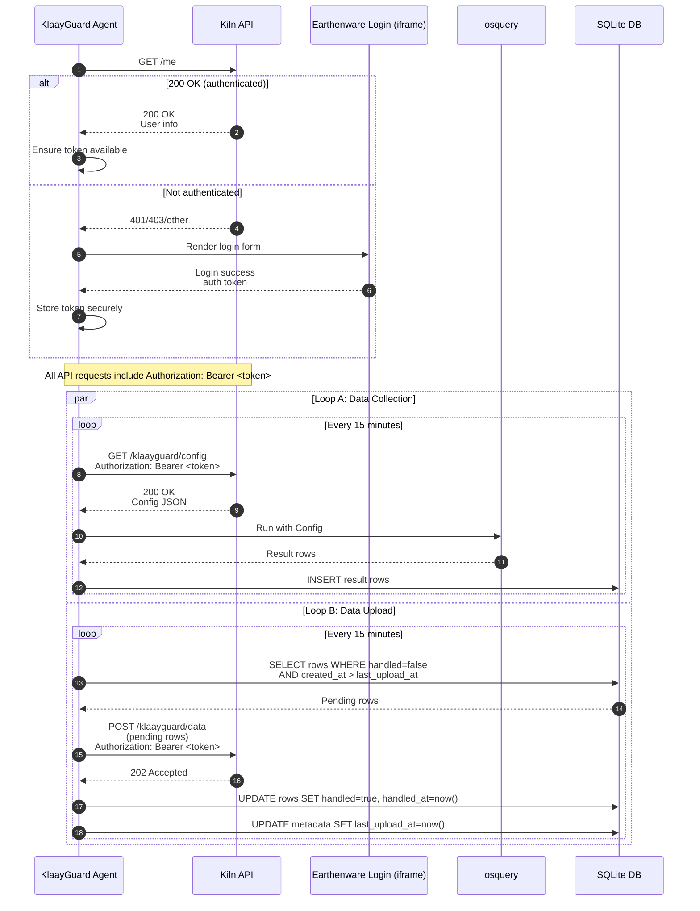

## KlaayGuard authentication, data collection, and upload sequence

The following sequence diagram documents the startup authentication check, followed by two 15-minute loops: (A) config fetch → osquery run → local store, and (B) upload pending data → mark handled. All API requests include the authentication token once obtained.

